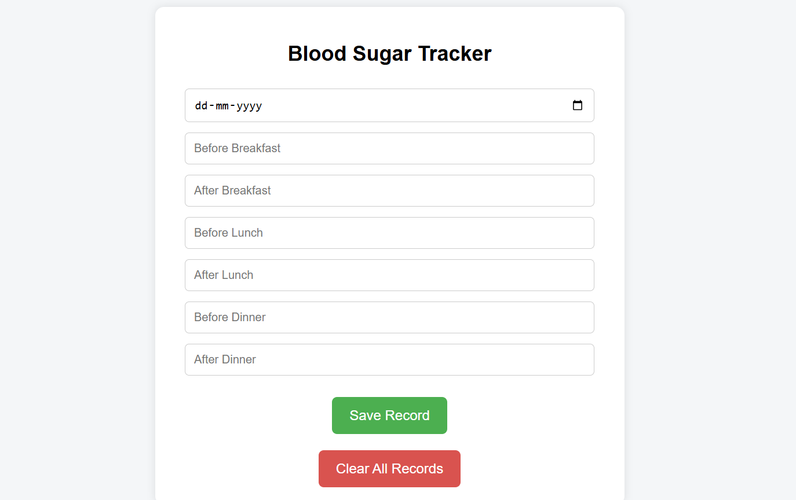
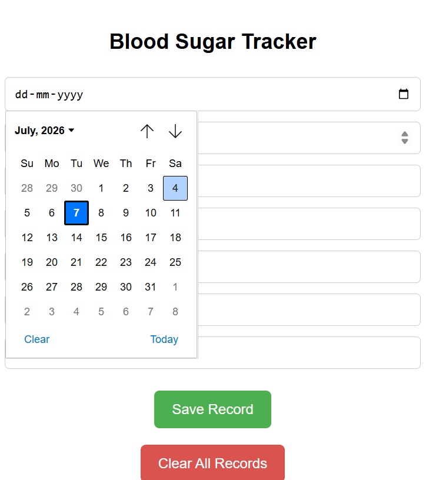
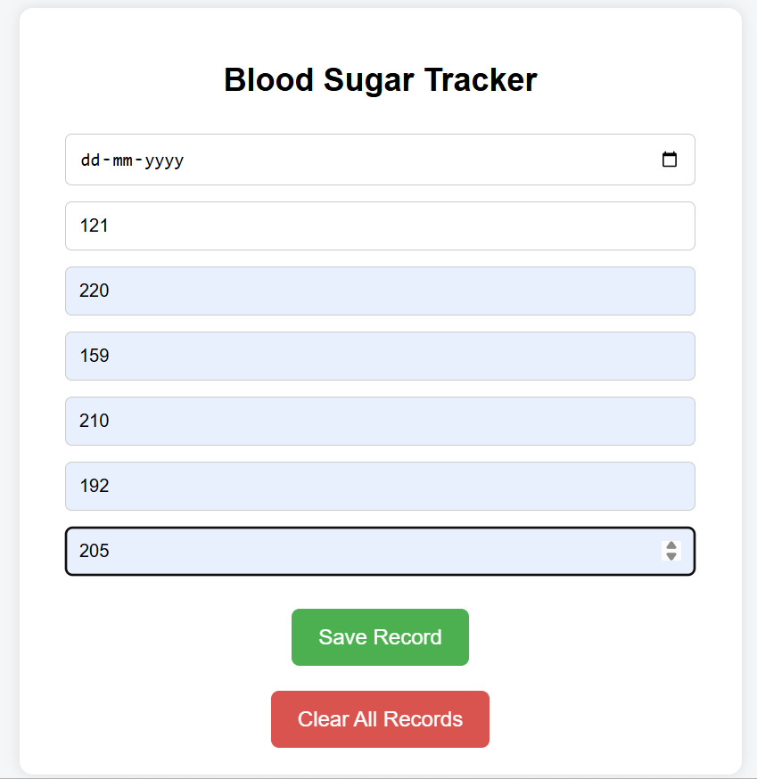

# 🩸 Blood Sugar Tracker (Flask Web Application)

A simple web application built using **Python, Flask, HTML, CSS, and Pandas** to help users record and monitor their daily blood sugar readings. The application stores the readings in a CSV file and displays them in a color-coded table for easy interpretation.

---

## ✨ Features

- 📅 Record daily blood sugar readings
- 🍳 Before & After Breakfast readings
- 🍛 Before & After Lunch readings
- 🌙 Before & After Dinner readings
- 🎨 Color-coded blood sugar level indicators
  - 🟢 Normal
  - 🟠 High
  - 🔴 Very High
- 🗑️ Clear All Records option
- 💾 Stores data in a CSV file

---

## 🛠️ Technologies Used

- Python
- Flask
- HTML
- CSS
- Pandas

---

## 📂 Project Structure

```text
blood-sugar-tracker/
│── app.py
│── data.csv
│── templates/
│     └── index.html
│── screenshots/
│     ├── home-page.png
│     ├── date-selection.png
│     ├── entering-values.png
│     └── saved-records.png
│── README.md
│── LICENSE
└── .gitignore
```

---

## 📸 Screenshots

### 🏠 Home Page

The main interface of the Blood Sugar Tracker.



---

### 📅 Date Selection

Select the date before entering blood sugar readings.



---

### 📝 Entering Blood Sugar Values

Enter blood sugar readings before and after meals.



---

### 📊 Saved Records

View all saved records in a color-coded table.


---

## 🚀 How to Run

1. Install Python.
2. Install the required packages:

```bash
pip install flask pandas
```

3. Run the application:

```bash
python app.py
```

4. Open your browser and visit:

```
http://127.0.0.1:5000
```

---

## 📌 Future Improvements

- Edit existing records
- Delete individual records
- Display blood sugar trends using graphs
- Improve the user interface
- Store data in a database
- Add user login and authentication

---

## 👩‍💻 Author

**Kshama Kulkarni**

First-Year Computer Science Engineering Student

This project was developed as a learning project to practice Python, Flask, HTML, CSS, and basic web development.
